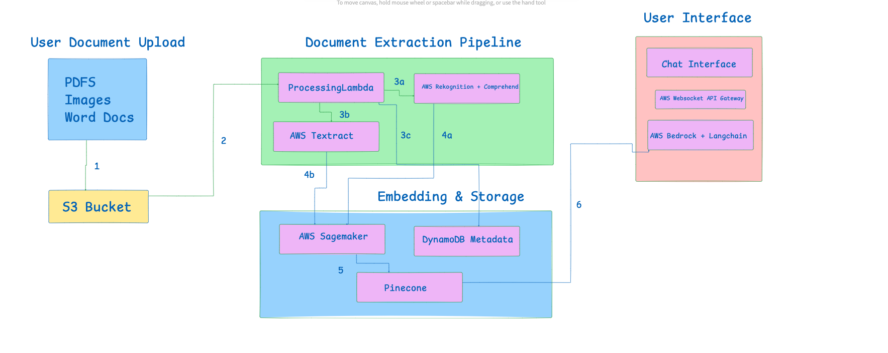
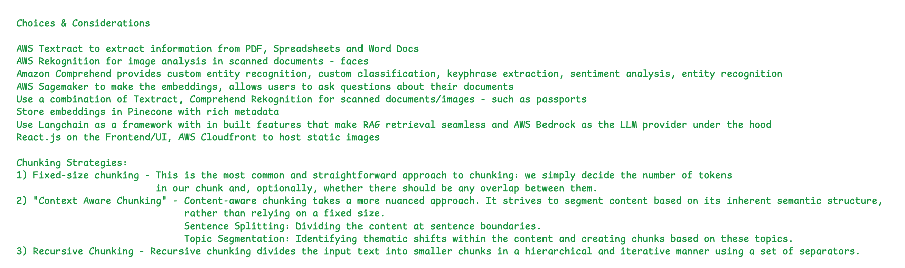
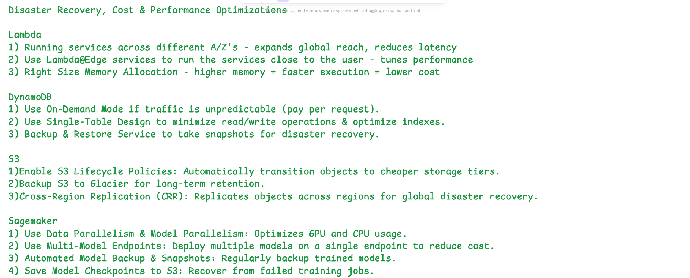
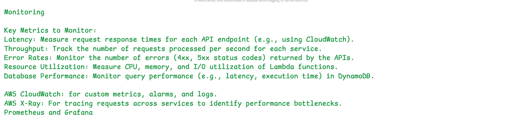
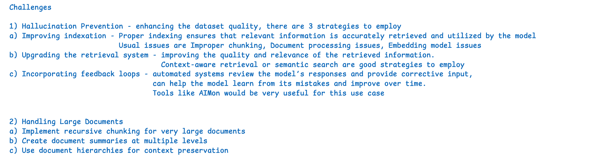

## Overview
This repository showcases my architectural design capabilities through detailed system diagrams, technical decisions, and strategic recommendations. Each case study demonstrates end-to-end consulting approach from business requirements analysis to scalable cloud solution architecture.

## 🏗️ Featured Architecture Case Study

### Enterprise Document Intelligence Platform
**A comprehensive RAG-based document processing system architecture designed during a strategic consulting engagement for enterprise-scale document analysis and intelligent querying.**

---

## 🎯 Business Problem
Organizations struggle with extracting actionable insights from large volumes of unstructured documents (PDFs, images, Word docs). Traditional search methods fail to provide contextual understanding, leading to inefficient information retrieval and missed business opportunities.

## 🔧 Recommended Technical Solution

### System Architecture Overview

**Key Components:**
- **Document Upload Layer**: S3-based storage with multi-format support
- **Processing Pipeline**: AWS Textract, Comprehend, and Rekognition integration
- **Intelligence Layer**: Vector embeddings with AWS SageMaker and Pinecone
- **Query Interface**: Real-time chat with AWS Bedrock and LangChain
- **User Experience**: React-based interface with WebSocket real-time updates

### Technical Architecture Recommendations

#### 1. **Document Processing Pipeline**

**Recommended Technology Stack:**
- **AWS Textract**: OCR and document structure analysis
- **AWS Comprehend**: Entity recognition and sentiment analysis
- **AWS Rekognition**: Image analysis for scanned documents
- **Lambda Functions**: Serverless processing for cost efficiency

**Architectural Benefits:**
- Handles multiple document formats simultaneously
- Scalable processing based on demand
- Cost-effective with pay-per-use pricing
- High availability with built-in redundancy

#### 2. **Intelligent Chunking Strategy**

**Recommended Implementation Approaches:**
- **Fixed-Size Chunking**: Predictable processing for consistent documents
- **Context-Aware Chunking**: Semantic boundary detection for better accuracy
- **Recursive Chunking**: Hierarchical processing for complex documents

**Strategic Rationale:**
- Optimizes retrieval accuracy vs. processing speed
- Reduces hallucination through proper context preservation
- Enables flexible querying strategies

#### 3. **Vector Database & Retrieval Architecture**

**Recommended Storage Strategy:**
- **Pinecone**: High-performance vector similarity search
- **DynamoDB**: Metadata storage for document relationships
- **S3**: Original document storage with lifecycle management

**Retrieval Optimization:**
- Hybrid search combining keyword and semantic matching
- Re-ranking based on relevance scoring
- Context-aware result presentation

### 📊 Performance & Scalability Recommendations

#### Optimization Strategies

**Lambda Optimization:**
- Multi-AZ deployment for reduced latency
- Lambda@Edge for global content delivery
- Right-sized memory allocation for cost efficiency

**Database Performance:**
- DynamoDB on-demand scaling
- Optimized indexing strategies
- Connection pooling for consistent performance

**Storage Optimization:**
- S3 lifecycle policies for cost management
- CloudFront CDN for static assets
- Intelligent tiering for frequently accessed data

### 🔐 Security & Compliance Framework

**Recommended Security Architecture:**
- IAM roles with least privilege access
- Encryption at rest and in transit
- VPC isolation for sensitive processing
- Audit logging with CloudTrail

**Compliance Considerations:**
- GDPR-compliant data handling
- Retention policies for document lifecycle
- Access control and user authentication
- Data residency requirements

### 📈 Monitoring & Observability Strategy

**Key Metrics to Track:**
- **Latency**: API response times and processing duration
- **Throughput**: Documents processed per second
- **Error Rates**: Failed processing and API errors
- **Resource Utilization**: Lambda, DynamoDB, and storage metrics

**Recommended Monitoring Tools:**
- **CloudWatch**: Custom metrics and automated alerting
- **X-Ray**: Distributed tracing for performance bottlenecks
- **Prometheus & Grafana**: Advanced visualization and analysis

### 🚀 Deployment & CI/CD Recommendations

**Infrastructure as Code:**
- Terraform for reproducible deployments
- Environment-specific configurations
- Automated backup and disaster recovery

**Development Pipeline:**
- GitHub Actions for continuous integration
- Automated testing for all components
- Blue/green deployment for zero-downtime releases

## 🔍 Technical Challenges & Recommended Solutions

### Challenge 1: Hallucination Prevention
**Problem**: AI models generating inaccurate responses from document content
**Recommended Solution**: 
- Multi-stage query validation
- Confidence scoring for responses
- Fallback mechanisms for uncertain queries
- User feedback loops for continuous improvement

### Challenge 2: Large Document Processing
**Problem**: Memory limitations and processing timeouts for large files
**Recommended Solution**:
- Recursive chunking with hierarchical processing
- Streaming processing for real-time updates
- Document summarization at multiple levels
- Intelligent context preservation

### Challenge 3: Cost Optimization
**Problem**: High processing costs for large-scale deployments
**Recommended Solution**:
- Intelligent resource allocation based on demand
- Caching strategies for frequently accessed content
- Spot instances for batch processing
- Usage-based pricing models

## 📋 Projected Implementation Results

**Projected Business Impact:**
- Reduced manual document review time by 60%
- Improved decision-making through faster insights
- Enhanced compliance through automated tracking
- Scalable solution supporting 10x growth

## 📞 Contact

For detailed discussions about this architecture or collaboration opportunities:

**Zubair Maqsood**  
Technical Architect  
📧 zubairmaqsood866@gmail.com  
🔗 [LinkedIn](https://linkedin.com/in/zubairmaqsood) | [GitHub](https://github.com/GH05T-97)
